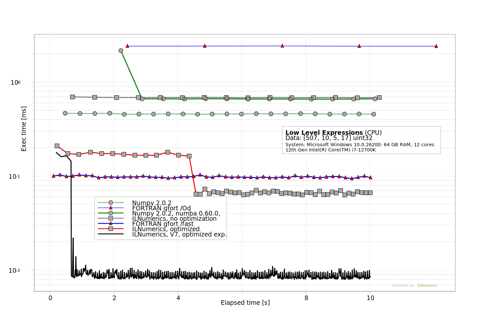

# Artifact 1 - Low Level Expressions

Compare execution speed of the low level expression 

`sum((m0 & (A << shift)) | (~m0 & B), dim: 1)`

on NumPy, NumPy + Numba, and FORTRAN,  with [ILNumerics Accelerator](https://ilnumerics.net/ilnumerics-accelerator-compiler.html) on moderately sized data. (A: `[507, 10, 5, 17]`, B: `[1, 1, 5, 17]`).

This benchmark involves broadcasting, unary and binary integer operations, and a sum-reduction and creates a plot, similar to this: 
 
Each sample in the plot gives the time needed for computing the expression, averaged over 10 repetitions. This 'current execution speed' is plotted for the first 10 seconds of the experiment and repeated for all execution technologies investigated. 

Observed execution times for all experiments over the app's running time allow to compare not only the general efficiency of the individual optimization methods. It also allow to inspect the behavior of the method during start-up and in a steady run.

## Benchmark Structure
All benchmarks are handled from `ILNumerics\Part1.csproj`. At runtime it starts the NumPy scripts (with and without Numba), starts the FORTRAN executables, and starts the ILNumerics .NET benchmarks. 
Each experiment is measured and repeated for 10 sec. Times needed for each completed iteration are written to csv files. 
Afterwards, the plot corresponding to Figure 4 in the paper is generated using measured results. 

## Clone the repository (all benchmarks)

```
git clone https://github.com/hokb/decentralized-array-execution-artifacts2026 
```
Navigate into directory: `Appendix/Part 1 Low Level Expressions`.

## Running the Benchmark using Docker ... (recommended)

This will: 
* build a debian based docker image, 
* install the .NET 8.0 SDK, 
* copy FORTRAN, NumPy and ILNumerics benchmark sources, 
* compile FORTRAN binaries (optimized and non-optimized)
* compile the ILNumerics assembly using ILNumerics Accelerator
* run the ILNumerics assembly, creating the final plot. 

### ... on Windows
```PowerShell
ps> .\run-docker.ps1
```

### ... on Linux

```bash
> .\run-docker.sh
```

## Running the Benchmark from Code
Make sure to have the latest .NET SDK and prerequisites to compile the FORTRAN sources installed. Find instructions in [here](/System%20Setup.txt).

Navigate into the `ILNumerics` subdirectory and start the project `Part1.csproj`

```bash
dotnet run -c Release
```

## Results
The benchmark generates the following results and places them into a new folder: `\Appendix\Part1 Low Level Expressions\result`.
* All measured times (5 measurements)
* Plots generated: Part1.bmp and Part1.svg

* ## Repeating the experiment / Re-Run
Re-Running the project will only re-create the plot. To trigger a new *measurement* just delete the `result` folder `Appendix\Part 1 Low Level Expressions\result\`.  


## Feedback
Please let us know about your findings! Did you observe similar results ? Get in touch and have us take a look: [benchmarks@ilnumerics.net](benchmarks@ilnumerics.net)
