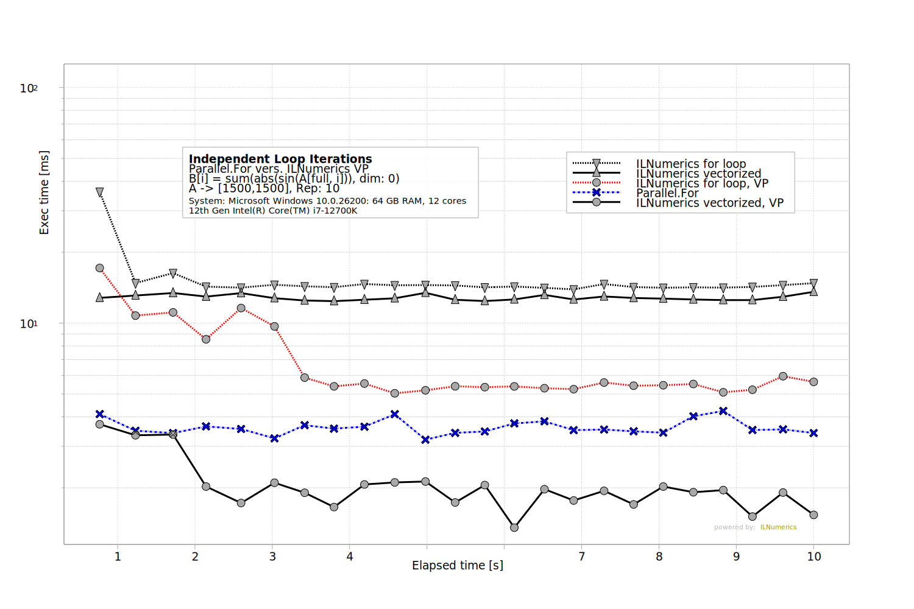
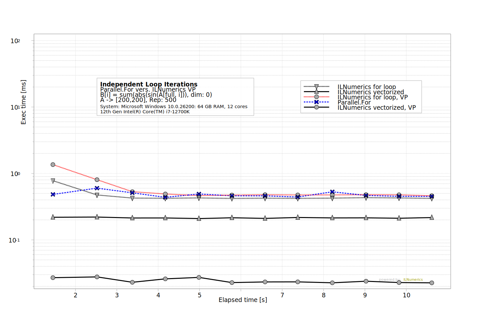

# Artifact 2 - Parallel.For vers. [ILNumerics Accelerator](https://ilnumerics.net/ilnumerics-accelerator-compiler.html)

This benchmark investigates the execution speed of various ways to parallelize: 

`sum(abs(sin(A)));`

for moderately sized A: `<double>[1500, 1500]` 

by running above expression ... 
* in vectorized / high-level form: `sum(abs(sin(A)))`, and 
* by manual iteration over the columns of A: 
  ```
  for (int i = 0; i < A.S[1]; i++) {
      CS[i] = sum(abs(sin(A[full, i])), dim: 0);
  }
  ```

Both ways are executed, using 
1) plain ILNumerics Computing Engine and 
2) ILNumerics Accelerator.  

Results are checked for correctness and compared with the manual iteration version using `Parallel.For`. 
 
Each sample in the plot corresponds to executing the high-level expression (either unmodified or by iterating along a single dimension) for 10 times (`rep`) and to measuring the accumulated execution time. This measurement is than repeated until 10 seconds have past. Observed execution times for all experiments over the app's running time allow to compare not only the general efficiency of the optimization methods investigate. They also allow to inspect the behavior of the method during start-up and in a steady run.

## Discussion
The baseline version is given by the high-level expression, executed by regular ILNumerics Computing Engine - without applying the Accelerator. This experiment is labeled `ILNumerics vectorized` in the plot. Attempting to split up the data to perform looping iterations over one dimension of `A` causes slightly slower execution - as expected. This version is labeled `ILNumerics for loop` in the plot. 

The ILNumerics Accelerator is able to speed this loop up and to run its iterations in parallel (`ILNumerics for loop, VP` in the plot). However, there is some overhead associated with the more fine grained parallelization in ILNumerics Accelerator. Thus, manual parallelization using `Parallel.For` for the data loop outperforms ILNumerics on this embarassingly simple parallelization example. This overhead is subject of ongoing improvement and will likely be decreased in a later version of ILNumerics. Further, the efficiency advantage of `Parallel.For` comes to the price of giving up sequential semantics of the loop iterations (see: [benchmark Part2b](../Part2b%20Loop%20Parallelization/Readme.md)) and it highly depends on the data size (see notes below).  

The fastest result is produced by ILNumerics Accelarator when applied to the unmodified high-level expression - without attempting any manual parallelization. This experiment is labeled `ILNumerics vectorized, VP` in the plot. 

## Benchmark Structure
All benchmarks are handled from `ILNumerics/Part2a.csproj`. At runtime the project starts the 5 benchmarks, measures execution times and creates a plot (bmp, svg) using measured results. 

## Clone the repository (all benchmarks)

```
git clone https://github.com/hokb/decentralized-array-execution-artifacts2026 
```
Navigate into directory: `Appendix/Part 2a Loop Parallelization`.

## Running the Benchmark from Code
Make sure to have the latest .NET SDK installed. Find instructions in [here](/System%20Setup.txt).

Navigate into the `ILNumerics` subdirectory and start the project `Part2a.csproj`

```bash
dotnet run -c Release
```

## Results
The benchmark generates the following results and places them into the projects **output** folder: 

`\Appendix\Part 2a Loop Parallelization\bin\Release\Net8.0\`:   
`Part2a.svg`,`Part2a.bmp`, and `values.csv`.

## Repeating the experiment / Re-Run
Re-Running the project will only re-create the plots. To trigger a new *measurement* just delete the `values.csv` from the output folder `ILNumerics\bin\Release\net8.0\values.csv`.  


## Notes
In a manual parallelization world the size of A (1500 x 1500 double elements) is commonly large enough to justify manual parallelization (i.e.: it pays off to split the array and distribute to multiple cores). Such size was chosen, to make the comparison fair. ILNumerics Accelerator, however, does *not* much depend on large-enough array data and it removes the need to manually split large data for manual parallelization.

Try modifying the benchmark to use smaller data and see, how the advantage of splitting the data for manuel parallelization decreases / vanishes, while the speed-up by ILNumerics Accelerator on the abstract high-level expression is retained: 


## Feedback
Please let us know about your findings! Did you observe similar results ? Get in touch and have us take a look: [benchmarks@ilnumerics.net](benchmarks@ilnumerics.net)

## More 
[ILNumerics Website](https://ilnumerics.net)  
[Benchmark 1: Low Level Expressions](../Part1%20Low%20Level%20Expressions/Readme.md)  
[All benchmarks](/Readme.md)