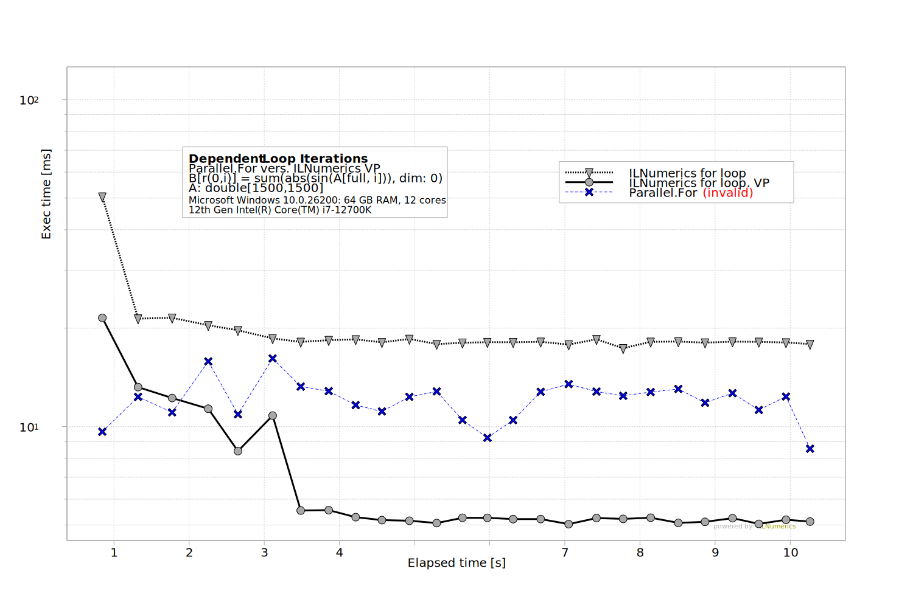
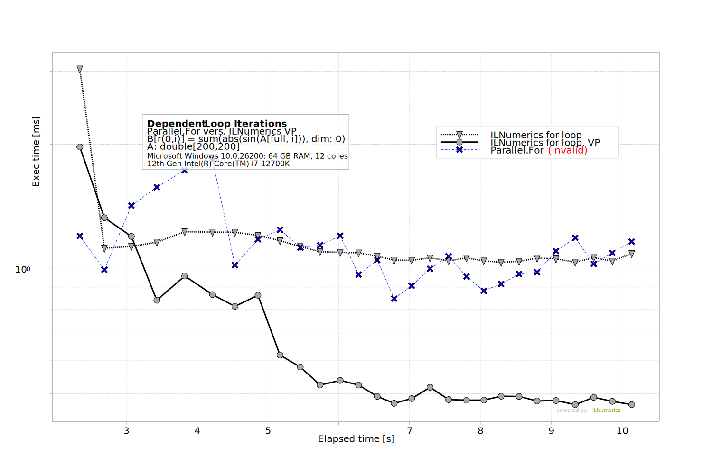

# Artifact 2b - [ILNumerics Accelerator](https://ilnumerics.net/ilnumerics-accelerator-compiler.html) vers. <em>Invalid Parallel.For</em>

This benchmark measures the speed-up by ILNumerics Accelerator when it is applied to a concrete, order dependent loop, as often found in iterative algorithms. 

```C#
    for (int i = 0; i < A.S[1]; i++) {
        ES[r(0, i)] = sum(abs(sin(A[full, i])), dim: 0);
    }
```
with `A` being a matrix of size `1500x1500` `double` floating point elements. While, normally, this problem size qualifies for `Parallel.For` parallelization, here, the subrange assignment on the left side depends on the iteration variable `i`. Further, the lower limit of the assignment range is set to `0`, so that later iterations overwrite such values, written by earlier iterations. Therefore, traditional parallelization will not produce correct results, since it does not retain the iteration order. 

The parallelization method used by ILNumerics Accelerator on the other hand *does* retain the original iteration order. In this benchmark we attempt to parallelize the loop by using `Parallel.For`, accepting incorrect results for the only purpose of acquiring an execution speed baseline for efficient (manual) parallelization. This is then compared to the correct parallelization by using ILNumerics Accelerator. 

This benchmark produces a plot, similar to this: 
 

## Discussion
The baseline in the generated output plot is labeled `ILNumerics for loop`. It iterates the whole loop in pure sequential order, using traditional, synchronous ILNumerics array functions. It shows reasonable execution speed (after a slight initial CLR JIT phase). 
The manual parallelization using `Parallel.For` gives some speed-up and - as expected - wrong results. Further, the graph shows pronounced peaks and valleys throughout the run, indicating that runtime performance remains unstable and fluctuates over the entire execution period. One reason for this fluctuation are contention issues, commonly introduced by blocking the main thread for waiting on computational workload chunks of significant size. 

The automatic parallelization performed by ILNumerics Accelerator (labeled by `ILNumerics for loop, VP` in the plot) shows a slightly longer adaptation period at the beginning of the run (~2..3 sec). Afterwards, the execution times of the baseline version are reliably and stable reduced by a factor ~3x and remain constantly below the measured times of the `Parallel.For` version - while producing *correct results*.

Note, to isolate the effect under study, we deliberately refrain from applying further optimizations (as to simply skip all but the last iteration). 

## Benchmark Structure
All benchmarks are handled from `ILNumerics\Part2b.csproj`. At runtime the project starts the experiments, measures execution times and creates a plot (bmp, svg) using measured results. 

## Clone the repository (all benchmarks)

```
git clone https://github.com/hokb/decentralized-array-execution-artifacts2026 
```
Navigate into directory: `Appendix/Part 2b Loop Parallelization`.

## Running the Benchmark from Code
Make sure to have the latest .NET SDK installed. Find instructions in [here](/System%20Setup.txt).

Navigate into the `ILNumerics` subdirectory and start the project `Part2b.csproj`

```bash
dotnet run -c Release
```

## Results
The benchmark generates the following results and places them into the projects **output** folder: 

`\Appendix\Part 2b Loop Parallelization\bin\Release\Net8.0\`:   
`Part2b.svg`,`Part2b.bmp`, and `values.csv`.

## Repeating the experiment / Re-Run
Re-Running the project will only re-create the plot. To trigger a new *measurement* just delete the `values.csv` from the output folder `ILNumerics\bin\Release\net8.0\values.csv`.  

## Notes
The size of `A` (1500 x 1500 double elements) is commonly large enough to justify manual parallelization (i.e.: it pays off to split the array and distribute to multiple cores). Such size was chosen, to make the comparison fair. ILNumerics Accelerator, however, does not so much depend on large-enough array data. Try to modify the benchmark to use much smaller data and see, how the advantage of splitting the data for manual parallelization vanishes, while the speed-up by ILNumerics Accelerator is retained: 


## Feedback
Please let us know about your findings! Did you observe similar results ? Get in touch and have us take a look: [benchmarks@ilnumerics.net](benchmarks@ilnumerics.net)

## More 
[ILNumerics Website](https://ilnumerics.net)  
[Benchmark 1: Low Level Expressions](../Part1%20Low%20Level%20Expressions/Readme.md)  
[Benchmark 2a: Loop Parallelization](../Part2a%20Loop%20Parallelization/Readme.md)  
[All benchmarks](/Readme.md)