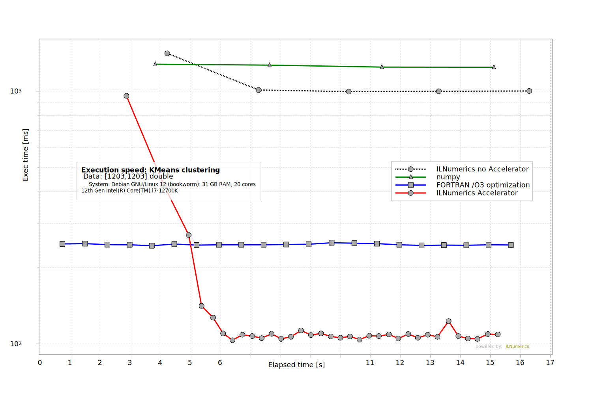

# Artifact 3 - K-Means Clustering

Compare the calculation performance of the *iterative* k-means clustering

on moderately sized data. (`A: [1203,1203]`),  
when executed by: 
* NumPy, 
* FORTRAN /O3 (all optimizations), with 
* [ILNumerics Accelerator](https://ilnumerics.net/ilnumerics-accelerator-compiler.html).

This benchmark uses the iterative k-means clustering algorithm for demonstrating the ability of ILNumerics Accelerator to speed-up even such algorithms, which spend most of their calculation time inside *order dependent loops*. Where traditional parallelization fails ILNumerics Accelerator is able to turn fine grained parallel potential into speed-up, gained on multiple computing devices. Here, Array Instruction Level Parallelizm (AILP) accelerates the iterative algorithm beyond FORTRAN speed by a factor more than 2. The benchmark shows further room for significant speed-up with optimization features which are currently still in experimental stage. It produces a plot, similar to the following: 
  
Each technology (NumPy, FORTRAN, ILNumerics) was provided with identical input data of size [1203x1203] and start configuration to ensure identical iteration count. Results were identity checked.
Each sample in the plot gives the time needed for computing the k-means clusters until convergence (here: 5 iterations). This 'current execution speed' is plotted for the first 15 seconds of the experiment and repeated for all execution technologies investigated. 

Observed execution times for all experiments over the app's running time allow to compare not only the general efficiency of the individual optimization methods. It also allow to inspect the behavior of the method during start-up and in a steady run.

## Benchmark Structure
All benchmarks are handled from `ILNumerics\Part3.csproj`. At runtime it starts the NumPy script, starts the FORTRAN executable, and starts the ILNumerics .NET benchmarks. 
Each experiment is measured and repeated for 15 sec. Times needed for each completed iteration are written to csv files. 
Afterwards, the plot corresponding to Figure 7 in the paper is generated using measured results. The paper publishes plots produced on Windows. Here, we present plots created on a Debian based Docker container - differences are discussed below. 

## Clone the repository (all benchmarks)

```
git clone https://github.com/hokb/decentralized-array-execution-artifacts2026 
```
Navigate into directory: `Appendix/Part 3 KMeans`.

## Running the Benchmark using Docker ... (recommended)

This will: 
* build a debian based docker image, 
* install the .NET 8.0 SDK, 
* copy FORTRAN, NumPy and ILNumerics benchmark sources, 
* compile FORTRAN binaries (optimized, using gfortran)
* compile the ILNumerics assembly using ILNumerics Accelerator
* run the ILNumerics assembly, starting all other measurements
* create the final plots. 

### ... on Windows
```PowerShell
ps> .\run-docker.ps1
```

### ... on Linux

```bash
> .\run-docker.sh
```

## Running the Benchmark from Code
Make sure to have the latest .NET SDK and prerequisites to compile the FORTRAN sources installed. Find instructions in [here](/System%20Setup.txt).

Navigate into the `ILNumerics` subdirectory and start the project `Part3.csproj`:

```bash
dotnet run Part3.csproj -c Release
```

## Results
The benchmark generates the following results and places them into a new folder: `\Appendix\Part 3 KMeans\result`.
* classes.csv - cluster assignments (from last experiment)
* input.csv   - common input data (for all experiments)
* values.csv  - measurment values (times, ms; for all experiments). Source for plot generation. 
* Plots generated: Part3.bmp and Part3.svg

* ## Repeating the experiment / Re-Run
Re-Running the project will only re-create the plot. To trigger a new *measurement* just delete the `result` folder `Appendix\Part 3 KMeans\result\`.  

## Discussion
ILNumerics Accelerator uses parallel potential on array instruction level and on sub-array instruction level (AILP). It enables to run multiple array instructions concurrently using multiple devices (as: the cores of the CPU) and also to compress array instruction execution start times in time by starting subsequent instructions as soon as the required sub-part of its input data is available. For example: the size of an input A is enough to start computing the size of the output of the function: `sin(A)`. 

This benchmark demonstrates that a reliable speed-up can be gained by using AILP. It quantifies this speed-up and shows a ~2 times speed-up compared to the FORTRAN (non-parallelized) baseline. Note, that it would not be trivial to parallelize the FORTRAN version (efficiently) - while ILNumerics Accelerator does not require any manual marks or decisions by the programmer. 

The benchmark also shows a significant warm-up overhead for the ILNumerics Accelerator. The authors believe that this issue can be addressed by more efficient caching of low-level kernels, by optimizing / pre-loading of compiler infrastructure at program start. Also, we believe that a further, significant speed-up can be gained by using kernel optimizations which are still in experimental stage currently (see: [Part1](..\Part1%20Low%20Level%20Expressions\Readme.md).

## Feedback
Please let us know about your findings! Did you observe similar results ? Get in touch and have us take a look: [benchmarks@ilnumerics.net](benchmarks@ilnumerics.net)
